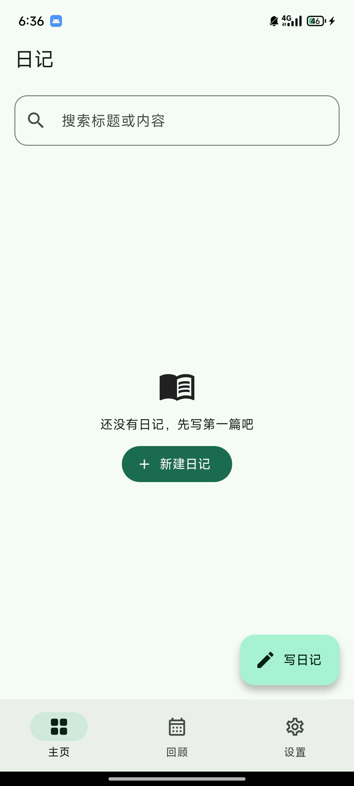
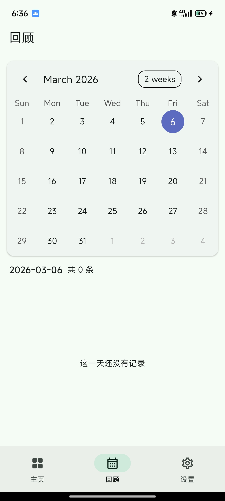

# 📔 Diary - 云迹

 

### 基于 Flutter 的智能增量同步日记应用

**云迹** 是一款兼顾“隐私主权”与“极致书写”的日记应用。我们相信数据应归用户所有，通过 **WebDAV** 协议实现无缝的增量备份，配合 **Material 3** 的灵动设计，为你提供最纯粹的记录空间。

  

    
    
      
  

## ☁️使用教程

以[坚果云](https://www.jianguoyun.com/#/)为例子,官方提供每月1Gb的上传流量,3Gb的下载流量,无限空间

且下载不限速

1. [生成应用授权密码](https://help.jianguoyun.com/?p=2064)
2. 然后回到APP设置中WebDAV配置即可

## ✨ 核心特性

###🖋️ 沉浸式创作中心 (Powered by Quill)

不仅是文字，更是生活的全维度还原：

- **全能富文本：** 支持加粗、斜体、三级标题 (H1-H3)、引用块及对齐方式。
- **多媒体融合：** 无缝嵌入高清图片，内置**矢量手绘涂鸦**组件，记录灵感瞬间。
- **元数据感官：** 自动抓取创作时的**地理位置、天气、心情**，并支持回溯修改。

###🎨 灵动设计 (Material 3)

- **自适应配色：** 全面适配 **Monet (Dynamic Color)**，界面色彩随壁纸律动。
- **多维回顾：** 瀑布流卡片预览与**热力图日历**并行，让往事有迹可循。
- **丝滑交互：** 全程 120fps 高刷体验，底部导航栏支持**单行左右滑动快速切换**，关键操作伴有细腻的触感反馈。

###☁️ WebDAV 智能增量同步

针对移动端优化的高效同步策略：

- **分块校验机制：** 基于 `Update_at` 时间戳与文件哈希，仅同步变更条目，节省流量与时间。
- **冲突决策：** 智能合并多端数据，支持“最后写入者胜”或“保留副本”模式。
- **隐私至上：** 数据直连你的私有云（如坚果云、Nextcloud），不经过任何第三方服务器。

------

## 🛠️ 技术架构

| **模块**       | **关键技术**                            |
| -------------- | --------------------------------------- |
| **UI 框架**    | Flutter (Dart)                          |
| **状态管理**   | Provider / Riverpod (建议补充具体方案)  |
| **编辑器核心** | `flutter_quill` 深度定制                |
| **本地存储**   | SQLite (ISAR/Sqflite) & Hive (配置信息) |
| **网络层**     | Dio & WebDAV Client                     |

------

## 🚀 性能表现

- **离线优先 (Offline-First)：** 核心逻辑在本地完成，后台静默同步，无网络时依然操作自如。
- **大图优化：** 智能缩略图生成与懒加载技术，确保列表滚动不掉帧。

------

## 📅 开发计划 (Roadmap)

[ ] **端到端加密 (E2EE)：** 在上传至 WebDAV 前进行本地加密，确保云端数据绝对安全。

[ ] **多端同步优化：** 桌面端 (Windows/macOS) 适配。

[ ] **AI 助手：** 基于本地模型的周报总结与心情分析。

------

## 🤝 参与贡献

欢迎提交 Issue 或 Pull Request 来完善 **Diary**。
